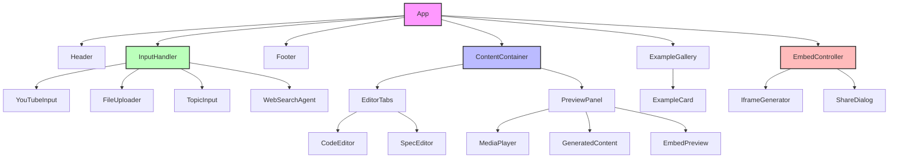

# Component Architecture

## Component Hierarchy

## Component Descriptions

### App (Root Component)
- Manages global state and routing
- Handles API key configuration
- Renders main layout structure

### Header
- Displays application title
- Contains navigation elements
- Shows current page/feature

### ContentContainer
- Core container for content generation
- Manages state for code and spec
- Handles communication with Gemini API
- Coordinates between editor and preview

### Footer
- Displays copyright information
- Contains links to documentation
- Shows version information

### ExampleGallery
- Displays pre-configured examples
- Handles example selection
- Shows example metadata

### EditorTabs
- Manages tabbed interface
- Switches between code and spec views
- Handles editor state

### CodeEditor
- Monaco-based code editor
- Syntax highlighting
- Code formatting
- Keyboard shortcuts

### SpecEditor
- Structured specification editor
- Validation
- Auto-formatting

### PreviewPanel
- Renders output preview
- Handles preview refresh
- Manages preview state

### YouTubePlayer
- Embeds YouTube player
- Handles video playback
- Manages player events

### GeneratedContent
- Renders generated output
- Handles dynamic updates
- Manages rendering errors

### ExampleCard
- Displays example information
- Handles click events
- Shows example metadata
