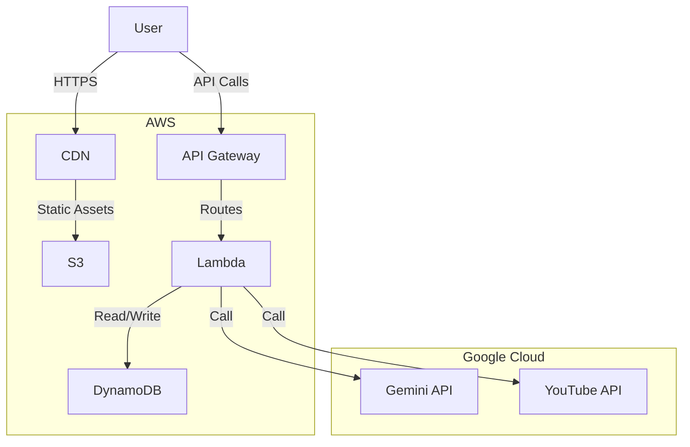
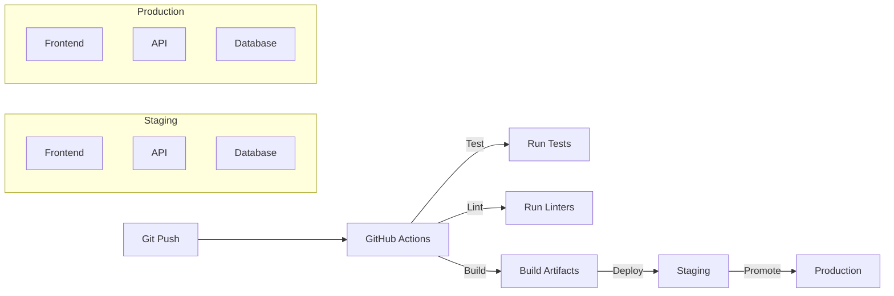

# Deployment Architecture

## Infrastructure Overview



## Deployment Components

### 1. Frontend
- **Type**: Static Website
- **Hosting**: AWS S3 + CloudFront
- **Build Process**:
  ```bash
  npm install
  npm run build
  aws s3 sync dist/ s3://praxeo-frontend
  ```
- **Environment Variables**:
  - `VITE_API_BASE_URL`: API endpoint
  - `VITE_GOOGLE_API_KEY`: Google API key (client-side)

### 2. Backend API
- **Runtime**: AWS Lambda (Node.js 18.x)
- **API Gateway**: REST API with custom domains
- **Environment Variables**:
  - `GEMINI_API_KEY`: Gemini API key
  - `DATABASE_URL`: Database connection string
  - `NODE_ENV`: Environment (production/staging)

### 3. Data Storage
- **Primary Database**: AWS DynamoDB
  - Tables:
    - `projects` - Project metadata and organization
    - `examples` - Main content examples
    - `code_snippets` - Associated code snippets
    - `specs` - Specification documents
    - `embeds` - Embed configurations and codes
    - `youtube_inputs` - YouTube-specific input data
    - `document_inputs` - Uploaded document data
    - `topic_inputs` - Topic-based generation data
    - `settings` - User and system settings

- **Object Storage**: AWS S3
  - Buckets:
    - `praxeo-assets` (for user uploads)
      - `documents/` - Uploaded PDFs and text files
      - `media/` - Other media uploads
    - `praxeo-frontend` (static website)
    - `praxeo-embeds` (generated embed content)

- **CDN**: CloudFront
  - Caching for static assets
  - Custom domains for embeds
  - Signed URLs for private content

### 4. New Services

#### 4.1 Document Processing Service
- **Purpose**: Handle PDF and text file uploads
- **Components**:
  - File validation
  - Text extraction
  - Content sanitization
  - Metadata extraction

#### 4.2 Web Search Agent
- **Purpose**: Research topics and gather information
- **Components**:
  - Search query generation
  - Web scraping
  - Content summarization
  - Source validation

#### 4.3 Embed Service
- **Purpose**: Generate and serve embeddable content
- **Components**:
  - Iframe generation
  - Access control
  - Usage analytics
  - Theme customization

#### 4.4 Media Processing Pipeline
- **Purpose**: Handle various media types
- **Components**:
  - Video transcoding
  - Audio extraction
  - Thumbnail generation
  - Content analysis

## CI/CD Pipeline



### Pipeline Stages

1. **Test**
   - Unit tests
   - Integration tests
   - E2E tests

2. **Build**
   - Frontend build
   - Lambda function packaging
   - Docker image building (if applicable)

3. **Deploy to Staging**
   - Deploy frontend to S3
   - Deploy Lambda functions
   - Run database migrations

4. **Promote to Production**
   - Blue/green deployment
   - Database migrations
   - Smoke tests
   - Traffic shifting

## Environment Configuration

### Development
- Local DynamoDB
- Mock API responses
- Hot reloading

### Staging
- Isolated AWS account
- Production-like configuration
- Test data

### Production
- Multi-region deployment
- Auto-scaling
- Monitoring and alerting

## Security Considerations

1. **Data Protection**
   - Encryption at rest (AES-256)
   - Encryption in transit (TLS 1.3)
   - API key rotation

2. **Access Control**
   - IAM roles and policies
   - Least privilege principle
   - Audit logging

3. **Compliance**
   - GDPR compliance
   - Data retention policies
   - Regular security audits

## Monitoring and Logging

- **Application Logs**: CloudWatch Logs
- **Metrics**: CloudWatch Metrics
- **Tracing**: AWS X-Ray
- **Alerts**: SNS notifications
- **Uptime**: Status page integration

## Scaling Strategy

### Horizontal Scaling
- API Gateway auto-scaling
- Lambda concurrency limits
- Database read replicas

### Caching
- CloudFront CDN
- API response caching
- Database query caching

### Performance Optimization
- Asset minification
- Code splitting
- Lazy loading

## Disaster Recovery

- Regular backups
- Cross-region replication
- Automated failover
- Recovery point objective (RPO): 5 minutes
- Recovery time objective (RTO): 15 minutes
