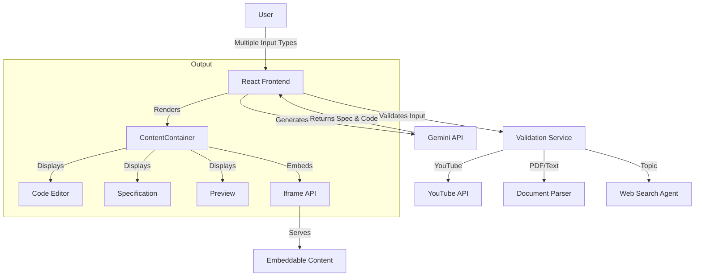

# Praxeo - Architecture Overview

## System Architecture

## Key Components

1. **Frontend Application (React + TypeScript)**
   - Built with Vite
   - Uses React hooks for state management
   - Monaco Editor for code editing
   - YouTube player integration

2. **Core Features**
   - YouTube video URL processing
   - Content specification generation
   - Code generation from specifications
   - Example gallery
   - Real-time preview

3. **External Integrations**
   - YouTube API for video validation and embedding
   - Google Gemini API for AI-powered content generation

## Technology Stack

- **Frontend Framework**: React 18 with TypeScript
- **Build Tool**: Vite
- **UI Components**: Custom components with CSS Modules
- **Code Editing**: Monaco Editor
- **State Management**: React Context API
- **API Client**: Fetch API
- **Package Manager**: npm

## Design Principles

1. **Component-Based Architecture**
   - Reusable, self-contained components
   - Clear separation of concerns
   - Unidirectional data flow

2. **Type Safety**
   - Comprehensive TypeScript types
   - Strict type checking
   - Interface-driven development

3. **Performance**
   - Code splitting
   - Lazy loading of components
   - Efficient re-rendering with React.memo

4. **Developer Experience**
   - Hot module replacement
   - TypeScript support
   - Linting and formatting
   - Comprehensive documentation
