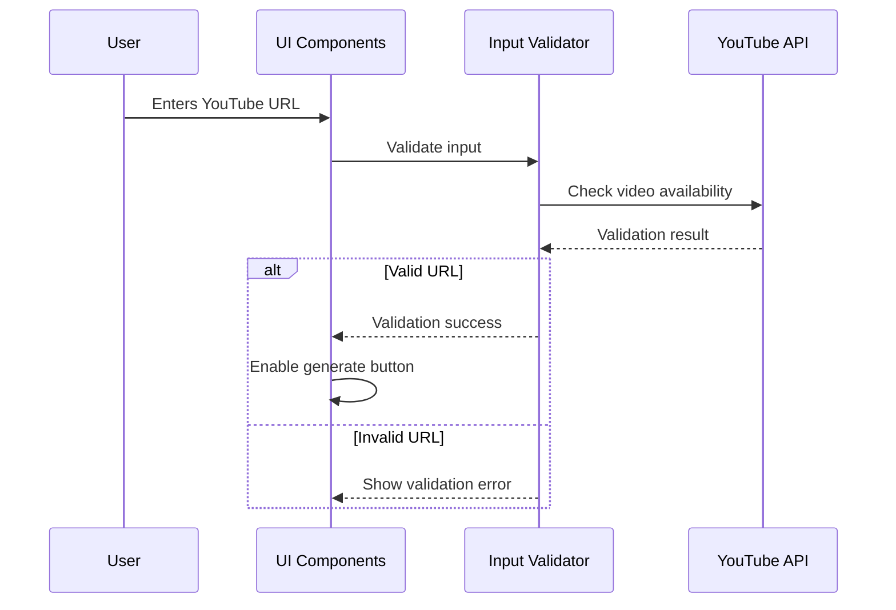
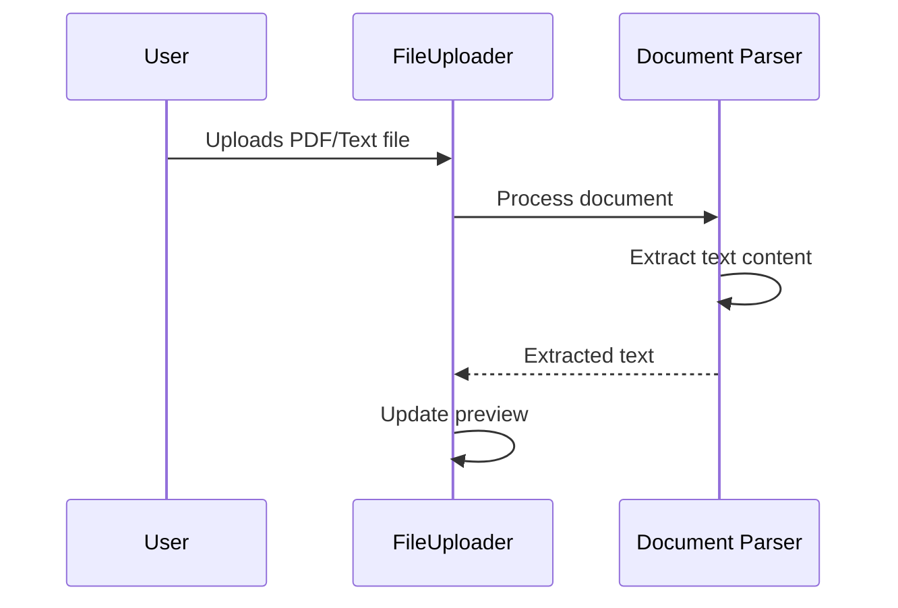
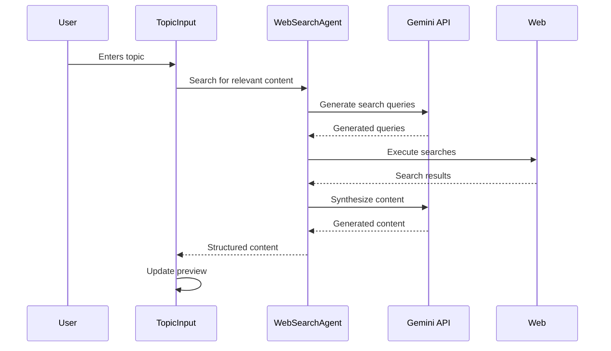
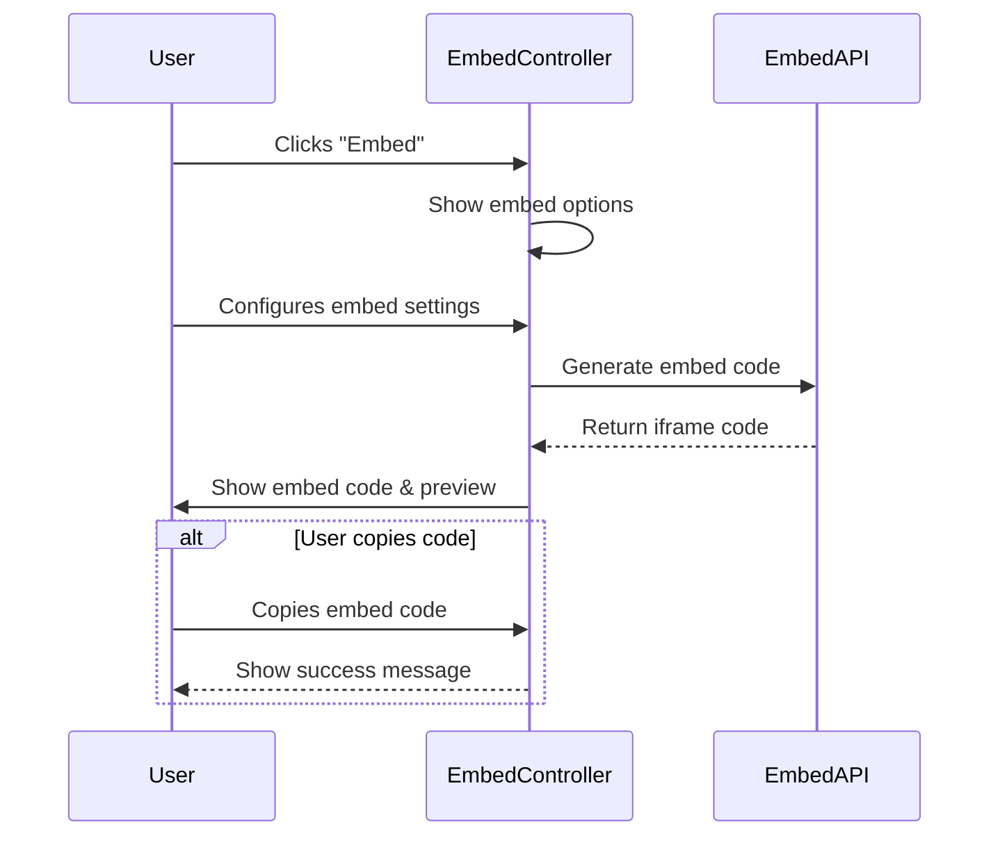
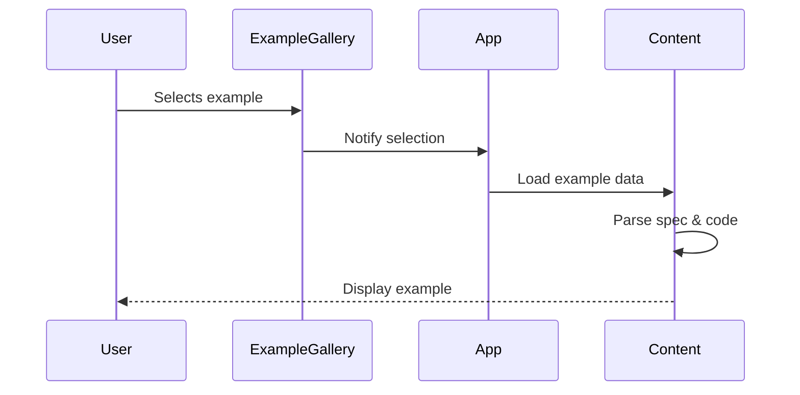
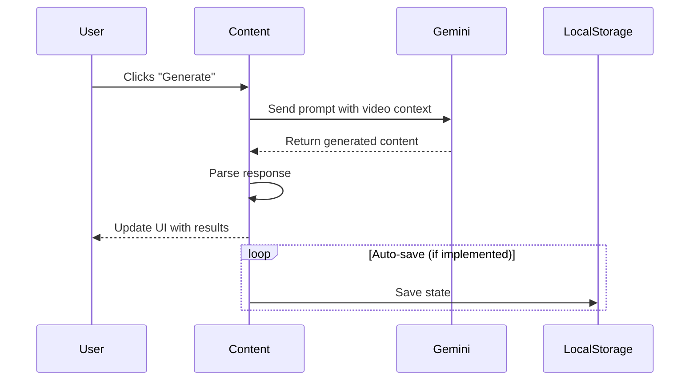
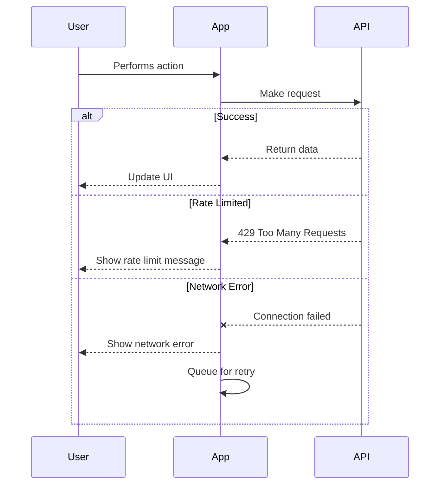
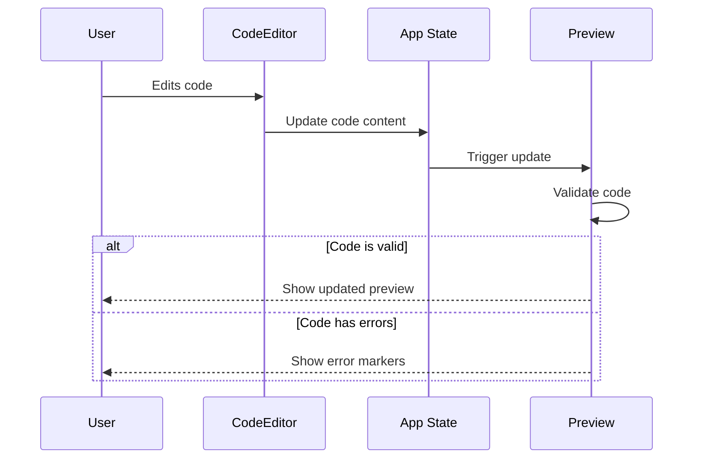

# Sequence Flows

## 1. Input Processing Flow

### 1.1 YouTube URL Processing

### 1.2 PDF/Text Upload

### 1.3 Topic-based Generation

## 2. Embedding Generation Flow

## 2. Example Selection Flow

## 3. Content Generation Flow

## 4. Error Handling Flow

## 5. Editor State Management

## Key Interactions

1. **Video Processing**
   - URL validation
   - Video metadata extraction
   - Content generation

2. **User Interface**
   - Example selection
   - Editor interactions
   - Preview updates

3. **State Management**
   - Form state
   - Editor state
   - API state

4. **Error Handling**
   - Validation errors
   - API errors
   - Network issues
   - Content generation failures
